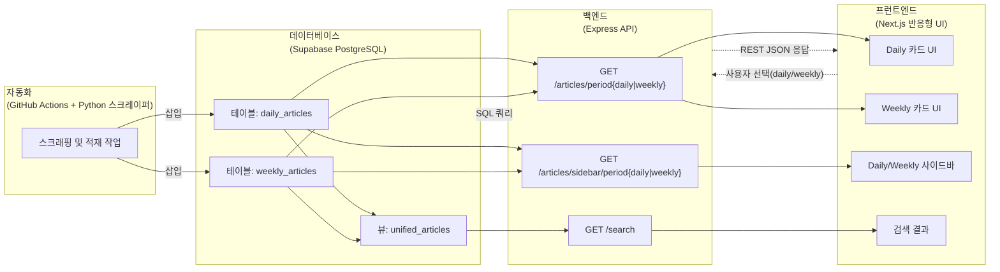
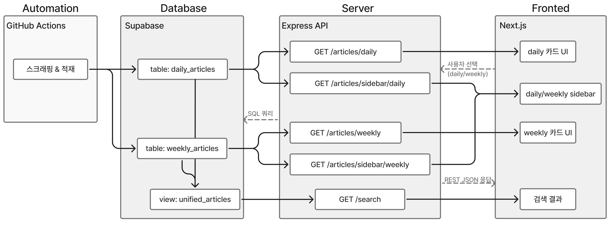

# 시스템 아키텍처 다이어그램 자료

## 핵심 메시지

- 수집(Ingest) → 저장(DB) → API → UI 흐름
- 자동화된 데이터 파이프라인으로 안정적인 서비스를 제공

## Mermaid 다이어그램 스크립트

```mermaid
flowchart LR
  subgraph Automation["자동화\n(GitHub Actions + Python 스크레이퍼)"]
    ingest["스크래핑 및 적재 작업"]
  end

  subgraph Database["데이터베이스\n(Supabase PostgreSQL)"]
    dailyTbl["테이블: daily_articles"]
    weeklyTbl["테이블: weekly_articles"]
    unifiedView["뷰: unified_articles"]
  end

  subgraph Backend["백엔드\n(Express API)"]
    articleAPI["GET /articles/period{daily|weekly}"]
    sidebarAPI["GET /articles/sidebar/period{daily|weekly}"]
    searchAPI["GET /search"]
  end

  subgraph Frontend["프런트엔드\n(Next.js 반응형 UI)"]
    dailyUI["Daily 카드 UI"]
    weeklyUI["Weekly 카드 UI"]
    sidebarUI["Daily/Weekly 사이드바"]
    searchUI["검색 결과"]
  end

  ingest -->|"삽입"| dailyTbl
  ingest -->|"삽입"| weeklyTbl

  dailyTbl --> articleAPI
  weeklyTbl --> articleAPI
  dailyTbl --> sidebarAPI
  weeklyTbl --> sidebarAPI
  dailyTbl --> unifiedView
  weeklyTbl --> unifiedView
  unifiedView --> searchAPI

  articleAPI --> dailyUI
  articleAPI --> weeklyUI
  sidebarAPI --> sidebarUI
  searchAPI --> searchUI

  Frontend -. "사용자 선택(daily/weekly)" .-> Backend
  Backend -. "REST JSON 응답" .-> Frontend
  Backend -. "SQL 쿼리" .-> Database
```

## Figma image

[Server Flow](../server-flow.md)
